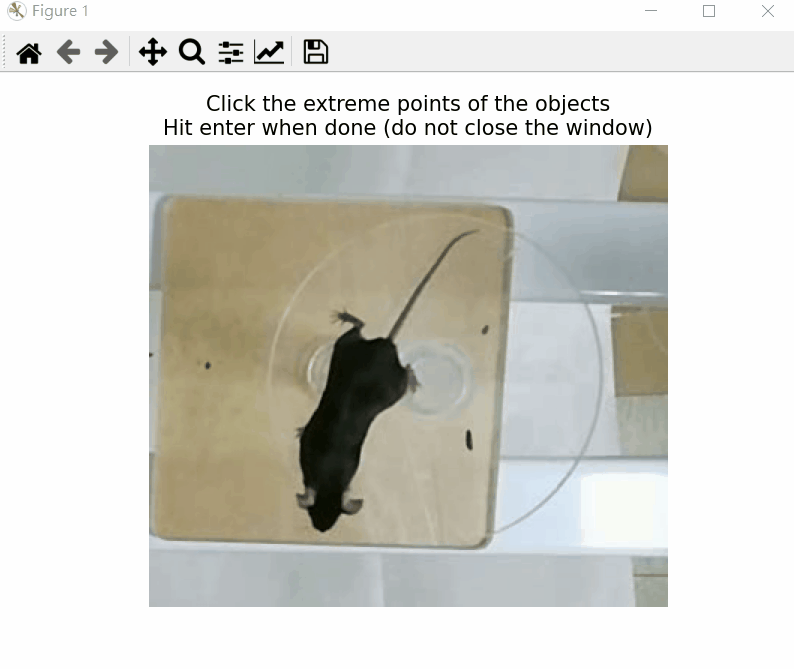

# roi_selector
 Select roi masks with only 4 clicks, and create coco annotations by masks.

## Installation

```Shell
pip install -r requirements.txt
```

* Install pytorch (torch==1.6.0+cu101, torchvision==0.7.0+cu101) manually from the official website.
* Download weights file [PASCAL + SBD](https://data.vision.ee.ethz.ch/kmaninis/share/DEXTR/Downloads/models/dextr_pascal-sbd.pth), and put it in "./models" folder

## Configuration

Edit the file "config.txt" with format below:

```Shell
image_folder = ./dataset/imgsel2
mask_folder = ./dataset/maskimg2
annotation_output = ./dataset/2.json
classes = mice/
colors = 255,0,0/
```

* image_folder : the folder of source image to crop segment (must include .jpg files)

* mask_folder : the folder to save segment mask image

* annotation_output : output json file path and filename

* classes : the labels of segment want to crop (separate by "/")

* colors : the colors for each class (separate by "/")

## Crop the image

When configuration done, and put source file inside image_folder run:

```shell
python roi_selector.py
```

Then the window will show up, then you can select four boundary points of the segment roi. Press enter when done, the mask image will generated automatically.



## Generate COCO format JSON file

After mask image created, run below command to generate.

```shell
python custom_coco_create.py
```

The JSON file will automatically create.

## Reference

Mask to coco : [ image-to-coco-json-converter](https://github.com/chrise96/image-to-coco-json-converter)

Image Segment : [ DEXTR-PyTorch](https://github.com/scaelles/DEXTR-PyTorch)
